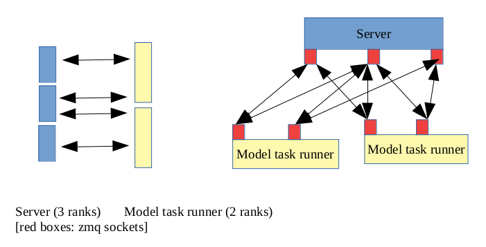

# Implementation of Melissa-DA

## Assuming stateless simulations.

## N-to-M communication

## Model task runner = Simulation

1. Read model runner id from Environment variable `MELISSA_DA_RUNNER_ID` if this is not set run simulation without Melissa-DA → skip all the rest of this document.

2. Gather field dimensions (hidden and assimilated) and also index maps from all model task runner ranks (`melissa_init`)

3. Model task runner rank 0 contacts server rank 0. The server responds with all it’s open data ports and if it needs the field dimensions

4. Model task runner rank 0 sends field dimensions and index map to server rank 0 if field dimensions were requested

5. Broadcast all server ports and model task runner id to all model task runner ranks

6. All model task runner ranks calculate the n to m scheme to know with which server ranks they will communicate

7. All model task runner ranks simulate the first timestep

8. All model task runner ranks send the first timestep plus their runner id to the corresponding server ports (e.g. model task runner rank 0 might be connected to server ranks 0 and 1 …). This acts as a request. The model task runner now wait that every server rank responds to (`melissa_expose`)

9. The response is either a message to end/kill the model task runner, a state message containing a new state to be propagated or a message that just tells propagate the same state again. (The response also contains how many timesteps to propagate the model in the next iteration = nsteps)

10. After this response do what was in the message (exit/propagate new state/the same state again)

11. if it was propagating a step send the result to the server as a request again. Goto 8.

All connections from the model task runners to the server are Request-Reply so far. Request reply connections always need a server response. Of course if the server has no work to distribute the model task runners will wait a bit for a reply. Model task runners do not listen to ports. They only connect to open server ports. Communication between the model task runner ranks is done using MPI.

## Server

1. Bind all data ports. We use ZMQ router sockets to be able to receive multiple messages from different model task runners on the same socket before replying to the first.

2. Send all open data ports to server rank 0

3. Server rank 0 tells the launcher that the server is up and ready for connecting runners

4. Check for model task runner registration. If a model task runner registers send it all the server’s data-request port names. If it is the first to do so also set a flag in the reply to request field dimensions.

5. If receiving the field dimensions send them to all other server ranks and finalize the init phases → now in the first propagation phase.

6. All server ranks calculate the n to m scheme

7. Server rank 0 Checks if the launcher is still up (no due date violation in received ping if not send kill messages to all connected runners (this may happen only in the next update phase)and quit server

8. All server ranks != 0 check for new scheduling messages from rank 0. Scheduling messages are linking an ensemble member to a model task runner and also give a due date for this task. If new schedulings arrived and if we have open connections to the model task runner of the new scheduling, send the parts of the states respectively to the model task runner

9. If data from a model task runner is incoming save it and send back a new state part if we got something scheduled for it. If not save the connection. If we are on server rank 0, schedule something new for this model task runner if nothing was scheduled and send the newly scheduled state parts back and tell all other ranks about the new scheduling.

  If we are on rank 0 and this is the first time we get data from the runner, notify the launcher about it.

10. Check for due date violations. If a rank != 0 detects one, just send it to rank 0. If rank 0 detects a due date violation or gets told by the other ranks of one he just reschedules the state to another model task runner. The old model task runner is put on the killed list. Server rank 0 also notifies the launcher about the due date violation (`TIMEOUT` message)

11. If a state is rescheduled that originally was scheduled on another model task runner, the old model task runner is put on a killed list. If there are already connections open to such killed model task runners, kill messages are sent back on them. Otherwise the exact same things as in step 7.

12. If a model task runner rank from the killed list sends data, a kill message is directly sent back.

13. If on a server rank all state parts were received, tell rank 0 that this server rank finished. If something is rescheduled after, this message is resent after the new scheduled task finished too.

14. If rank 0 got finished messages from all other server ranks and he finished on his own, send to all other server ranks to change to update phase (finished messages are numbered by the highest scheduling id. Thus a finished message contains actually information like server rank x finished with all schedulings up to scheduling id y)

15. do the assimilation update on all server ranks in parallel after all server ranks received from rank 0 to change into update phase

16. Server rank 0 reschedules an ensemble member to all its runners. Change to propagation phase on all server ranks

17. If the last assimilation step is reached, end messages are responded on all open connections, and the server exits.

18. Otherwise start over from step 7

Steps 7 to 14 are looped all the time when in propagation phases. Communication between server ranks happens via MPI. We make heavily use from `MPI_Isend` and `MPI_Recv` for asynchronous (scheduling) Broadcassts between the server ranks. Server rank 0 acts as a master who tells to other ranks what to schedule where. Model task runners get responses from the server ranks on 3 events:

- either when the server rank 0 schedules new stuff on a open connection

- or if a connection is opened (runner requesting work) and the next task is already scheduled on it

- or if the server is rescheduling a task on another model task runner. Then the old one’s open connections are responded with appropriate kill messages.

## Launcher

Users start the Launcher.

1. Check if no server is up. If so start a Server (if we did not try this too often yet, otherwise we crash)

2. if the server took to long to start up (no notification from server that it is ready for too long since the server job started running) restart the server (goto 1)

3. check if we need to send a new ping to the server.

4. if server is up and not enough runners are at least scheduled, start a runner with a unique id set in the `MELISSA_DA_RUNNER_ID` environment variable

5. if a runner took too long to start up (no notification from server that the runner is ready for too long since the runner job started running), mark the runner as crashed and remove its scheduling

6. check if the server ping arrived. If not remove all runners and goto 1

7. check if the scheduler says that the server crashed. If so remove the server job and goto 1

8. check if the server sent a runner timeout message. If so remove the runner job.

9. check if the scheduler says that some runner crashed. If so remove the runner job

10. check if the server said that the study finished. If so remove all runner jobs and end gracefully. Otherwise goto 1
